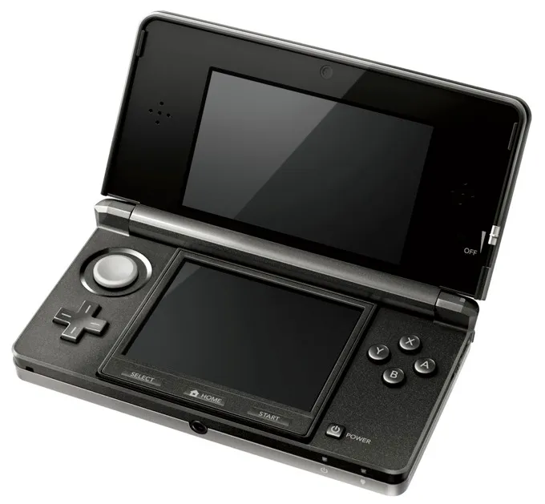

## llama2-3ds

<p align="center">
  
</p>

Have you ever wanted to inference a baby [Llama 2](https://ai.meta.com/llama/) model on your 3ds? No? Well, now you can!

As you can probably see at the top of the repository, it is a port of Karpathy's [llama2.c](https://github.com/karpathy/llama2.c). Please refer to the original repo for the full details. I will simply explain what is different in this one.

The Makefile and source folder are where the main changes are. You can run a pre-trained model in the .bin format on your 3ds/3ds emulator. Please note that I build on Windows and test on the Old 3ds.

## how to build

In the root folder:

```bash
make
```

The llama2-3ds.3dsx file can be run on a 3ds directly. The model and tokenizer binaries will be packaged in the 3dsx file so there is no need to transfer any other files to your 3ds.

## models

You may have noticed that there is only one build command with no real customisability. Yes, currently, only one model is supported. The other models are too large to run on the (old) 3ds without quantization. I will try to add support for the quantized versions soon.

| model | parameters | dim | n_layers | n_heads | n_kv_heads | max context length | val loss | download                                                                        |
| ----- | ---------- | --- | -------- | ------- | ---------- | ------------------ | -------- | ------------------------------------------------------------------------------- |
| 260K  | 260K       | 64  | 5        | 8       | 4          | 512                | 1.297    | [stories260K](https://huggingface.co/karpathy/tinyllamas/tree/main/stories260K) |

## usage

Once built and opened on a 3ds, you will be prompted with a few options. Just follow these and use the on-screen keyboard to write your "prompt". Note that it is not a chatbot and it will complete your prompt as opposed to responding as chatGPT etc would. I might add support for the chat feature eventually.

## License

MIT
